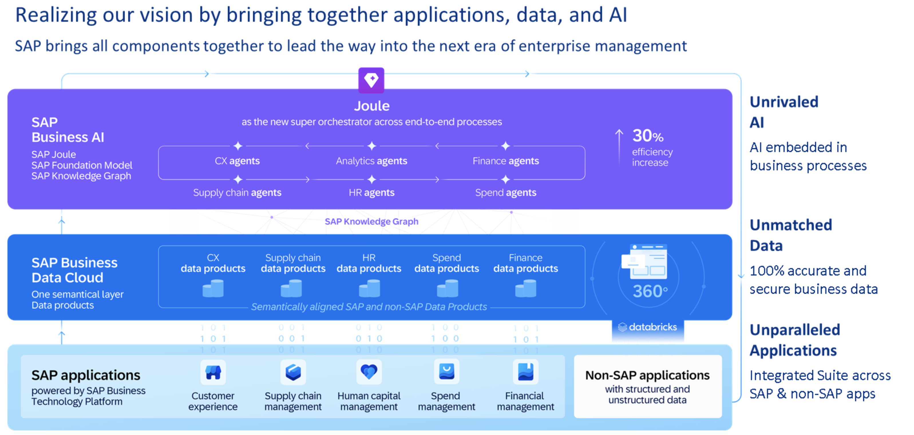
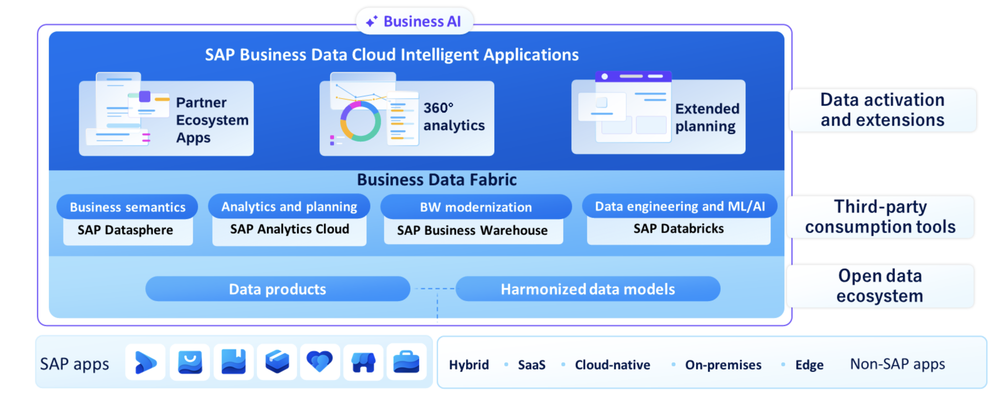

# Positioning SAP Business Data Cloud

## The Advantages of SAP Business Data Cloud

Organizations that make data-driven decisions today face three big challenges:

1. Uncover the hidden potential in their business by unlocking seamless access to critical insights.

2. Boost confidence in their data quality and integrity to empower data-driven decisions.

3. Harness the power of fragmented, unstructured data sources and turn them into valuable business insights.

- SAP centralizes data from SAP and non-SAP sources into a unified semantic layer => unlocking new dimension of insights + advance analytics + AI capabilities.
  - Integrating cross-comapny data, businesses gain actionable intelligence to bridge transactional processes and drive AI-powered growth

## Core Innovations of SAP Business Data Cloud

1. One solution for all data and analytics requirements

   - SAP Business Data Cloud is a SaaS solutuon equipped with data and analytics services
   - SAP Business Data Cloud combines SAP HANA Cloud, SAP Datasphere and SAC in one solution

2. Single solution for deiverse audiences and usecases

   - Offers tools and technologies to meet all data and analytics requirements of a modern and agile organization.
   - Services: Out-of-the-box reporting, Machine learning and artificial intelligence, Advanced data modeling and data warehousing, Powerful planning and reporting, Intelligent data management.
   - SAP Business Data Cloud provides data warehousing features including a manual data integration and data modeling approach, AI and machine learning based extensions of data models as well as innovative out-of-the-box reporting capabilities side-by-side. With this wide range of functions, it covers all the requirements of a modern data and analytics solution and thus serves different target audiences with different requirements.

3. End-to-end data lifecycle managed by SAP

   - SAP's role as a provider goes beyond the tasks that maintain security, availability and performance in SaaS landscape
   - SAP uses its knowledge and experience to bundle, integrate, harmonize, and transform customers' business data across different business applications such as SAP S/4HANA, SAP Customer Experience or SAP SuccessFactors in an unprecedented approach.
   - To prepare for seamless use across all SAP Business Data Cloud scenarios and third-party tools, the business data that is managed by SAP is integrated into a hyperscaler environment, and undergoes cleansing, harmonization, and enrichment.

4. Out-of-the-box reporting

   - A key highlight of SAP Business Data Cloud is its out-of-the-box reporting capability, featuring SAP Business Data Cloud Intelligent Applications, which create business insights with a single click, empowering informed decision-making.
   - Specifically, here is what happens when you install an Intelligent Application:
     - Automated creation of artifacts across all tools and components.
     - Automated data management steps.
     - Automated data provisioning from data source to dashboard.
     - Automated ready-to-consume business insights.
