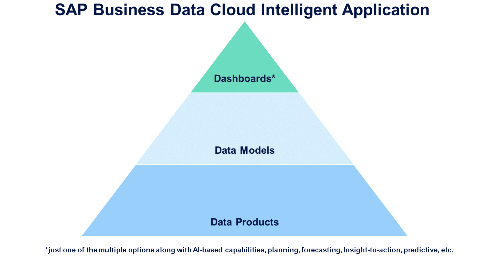

# Illustrating a Business Use Case for SAP Business Data Cloud

## SAP Business Data Cloud Intelligent Applications and Data Products

- SAP Business Data Cloud Intelligent Applications are the primary focus when discussing out-of-the-box analytical capabilities in SAP Business Data Cloud.

- Intelligent Application consist of multiple interconnected objects, artifacts, and tasks that are executed and created during their installation:

  - Data Products: The basis of your Intelligent Application is raw business data from the various source systems. As part of the installation process of your Intelligent Application, data is replicated from the source systems to SAP Business Data Cloud and one or more Data Products are generated.
  - Data Models: On top of the Data Products, data model artifacts are generated. These offer opportunities for extension of models and the definition of user authorizations.
  - Dashboards: The top-level of your Intelligent Application is the analytical dashboard which can include forecasting, AI-powered decision support, insight-to-action, and planning capabilities.

- Once the Intelligent Application is installed, all operational activities, such as continuous data provisioning tasks, are automatically taken care of. You do not need to setup data loading schedules.
