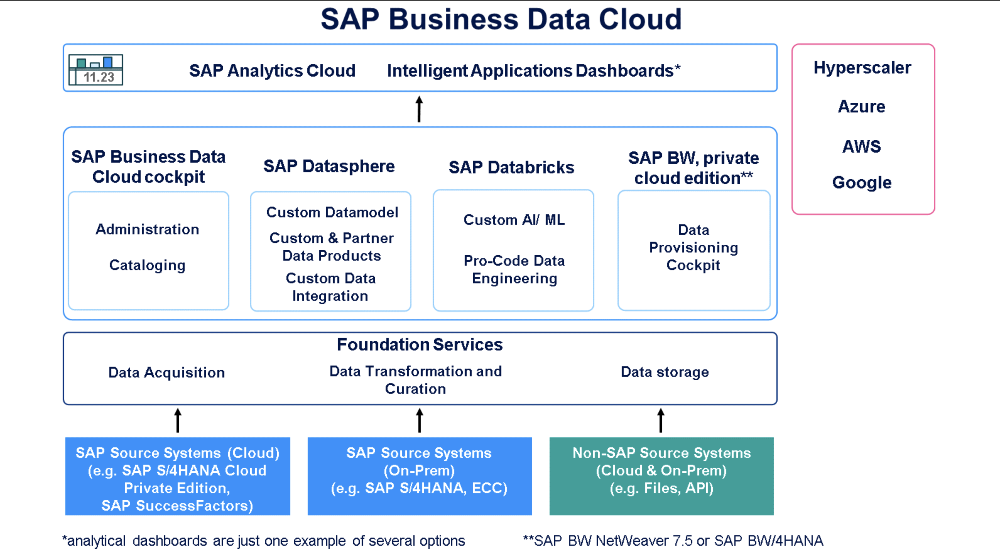

# Exploring the Architecture of SAP Business Data Cloud

## Arhitecture of SAP Business Data Cloud

- As illustrated in the graphic, the SAP Business Data Cloud system landscape consists of different interconnected components. Each component plays an important role in SAP Business Data Cloud, with specific tasks that are outlined in the following sections.

1. Source Systems
   We start by examining the source systems, which encompass both SAP systems (for example, SAP S/4HANA Cloud Private Edition or SAP SuccessFactors) and non-SAP systems. With SAP S/4HANA Cloud Private Edition serving as an example, the data journey begins when SAP bundles customer business data, making it available for various analytical use cases within SAP Business Data Cloud. Entities such as tables and views are combined and made available to represent a specific business scenario (for example, working capital) before the data is replicated to SAP Business Data Cloud.

2. Foundation Services
   When analysis is required, the bundled data from your source system (for example, SAP S/4HANA Cloud Private Edition) is replicated into the Foundation Services of SAP Business Data Cloud. This data is then harmonized with other relevant business data from other business applications, transformed, and enriched to become a Data Product. From this moment on, it is located in a hyperscaler environment based on SAP HANA Cloud, Data Lake files and is ready to be used for every use case that is supported by SAP Business Data Cloud. What this means for you is that all necessary data management steps such as integration, transformation, cleansing, and so on are fully managed by SAP.

3. SAP Datasphere
   At the heart of SAP Business Data Cloud is SAP Datasphere, which provides the foundational structures that define the data model on top of the Data Products. This includes predelivered SAP Business Data Cloud Intelligent Applications and Data Product scenarios but also scenarios with custom data models that can be manually extended with machine learning or AI. SAP Datasphere also serves as a central tool for managing analytical roles and data access control, helping you to determine which business users can view specific data.

4. SAP Databricks
   An SAP-tailored Databricks component (called SAP Databricks) is used in SAP Business Data Cloud when extending your analytics with functions that are based on AI, machine learning, and Pro-Code engineering. There are different approaches to make this possible. On the one hand, you can share Data Products from SAP Business Data Cloud Catalog with SAP Databricks, to extend them accordingly and to push them back to SAP Business Data Cloud Catalog. On the other hand, you can share data directly from SAP Databricks into SAP Business Data Cloud Catalog. In both cases, your data models can be extended to enrich classic analytics with insights that are usually implemented by Data Scientists.

5. SAP BW or SAP BW/4HANA
   SAP BW has a rich history in SAP's data and analytics ecosystem, with a large collection of established, legacy objects. For these reasons, it is integrated into SAP Business Data Cloud if you use the SAP BW NetWeaver Cloud, private edition or the SAP BW/4HANA Cloud, private edition. The approach makes it possible to technically onboard SAP BW objects into SAP Business Data Cloud, allowing them to be used as Data Products. Within this framework, SAP BW is supported until 2030, but we recommend taking the modern approach with SAP BW/4HANA as soon as possible.

6. SAP Analytics Cloud
   SAP Analytics Cloud stories are used to provide the required dashboard in out-of-the-box reporting scenarios with SAP Business Data Cloud Intelligent Applications. With its advanced visualization and planning functions, SAP Analytics Cloud serves the business user as a central tool for exploring the requested business insights or executing planning functions. Furthermore, using SAP Analytics Cloud, business users can run ad-hoc analysis, explore the provided data with AI-driven chat capabilities, or act on their insights with AI-driven suggestions, bridging the gap between analytics and their end-to-end business processes.

7. SAP Business Data Cloud Intelligent Applications
   Intelligent Applications are not limited exclusively to SAP Analytics Cloud. In addition to the analytical dashboards, or planning templates provided by SAP Analytics Cloud, it is planned to provide SAP Business Technology Platform based Intelligent Applications. These SAP managed Software-as-a-Service applications are delivered in SAP Business Data Cloud to focus on various action-driven scenarios such as analytics, prediction, or forecasting.

8. SAP Business Data Cloud cockpit
   The SAP Business Data Cloud cockpit has an important role in the overall SAP Business Data Cloud landscape. With this tool you can browse and find predelivered Intelligent Applications and Data Products, install Intelligent Applications, and share Data Products with SAP Databricks to be able to extend them with AI, and machine learning capabilities.
