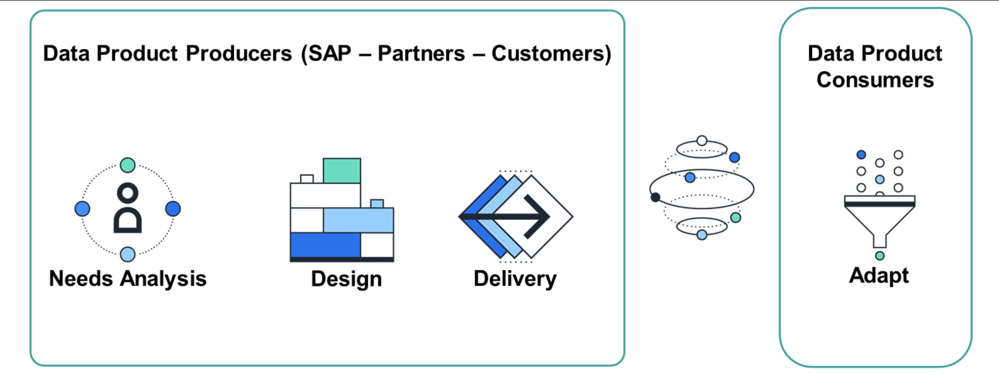
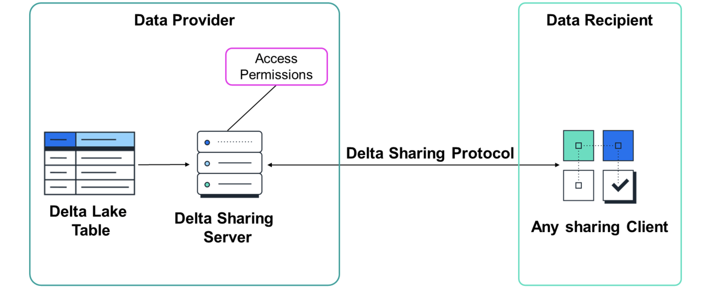

# Explaining Foundation Services and Data Products

## Foundation Services and Data Products

- To analyze operational data coming from your different SAP sources, you were used to extract, transform, merge, and load those data into your different analytical applications. However, this process assumes you already have a deep and precise knowledge of the operational data model. You can then develop transformations to generate the analytical model you need. And finally, create the visualization on top.

- SAP Business Data Cloud is there to help you get to that visualization point without effort or precise knowledge about the underlying operational data model.

## The Concept of Data Product

- The new standard for integration is Data Products. The operational data are seen as a product with predefined and stable structure and interfaces, lifecycle management, and documentation.

- With Data Products, you only have to consume the data provided and adapt it to your specific use cases. All the extraction, harmonization, and joining of the different tables has been done for you by the Data Product provider. The Data Product providers follow a standard process including needs analysis, design, and delivery phases.

- A Data Product is a "data set" which can include either master data or transaction data.

- A Data Product is exposed by a "producer" to fulfill the needs of "consumers".

- The data set is optimized toward "intensive reads" and consumed in a read-only fashion.

- It's the Data Product's responsibility to describe itself. The description is provided by the producer using Open Resource Discovery(ORD).

- Data Products have owners who are responsible for defining what Data Products to produce to meet the needs of consumers. The owners of the data product (at least of its definition) are ideally the domain owners / the same team that is responsible for the operational data (decentralized data products)

- Data Products are grouped into Data Packages.
  Some examples of Data Products could be CountryRegion, HANACurrency, Cost Center, Journal Entry Header, Ledger, Financial Planning Entry Item, and so on.

### Examples

The _Financial Planning Entry_ Item Data Product, for example, is a combination of several entity types like Financial Planning Entry Item and Planning Category.

A Data Package could contain, for example, both CountryRegion and HANACurrency Data Products, as Cross Applications items.

Another Data Package could contain all the Data Products for Accounting and Financial Close, including Journal Entry Header and Financial Planning Entry Item.

## The concept of Delta Share

- In operational environments, where you manage a reasonable volume of information, you store data inside relational databases, such as SAP HANA Cloud database. However, in analytical environments, this storage can become expensive because the volume of data can be overwhelming. You can then decide to store your data in a Data Lake style, which means it is stored in files.

- Storing data into files can also widen the range of tools that will be able to consume your data.

- Data Products can be consumed in different ways, the main one being through the Delta Sharing protocol. This open protocol enables data access:

  - Without moving/copying data (zero-copy concept).
    Through a variety of methods to support most consumption tools.
    With a central governance.
    In a scalable way.
    Using Delta Sharing, a data provider can share its cloud-stored tables or partitions in Delta Lake format.
  - Delta Lake is an open-source file format that provides significantly faster metadata operations for large tabular data sets. It offers relational-like features such as caching mechanisms and specific SQL-on-files commands.
  - The data provider chooses the data to share and manages access through a sharing server that uses the Delta Sharing protocol.

- The data consumer just needs one of the many Delta Sharing clients who support the protocol. Some open-source connectors have been released, for example, for Apache Spark and Python.

- The protocol ensures the client authenticates to the sharing server and makes sure it's allowed to access the data asked in the query. Then, it logs the request and determines which data to send back. The sharing server then creates temporary URLs for the client to download files directly from the cloud provider. This process allows for fast, large-scale data transfer without going through the sharing server, making it efficient and cost-effective.

## The Purpose of the Foundation Services of SAP Business Data Cloud

- One of the primary goals of SAP Business Data Cloud is to provide Data Products and Delta Share mechanism.

- In SAP Business Data Cloud, the Data Products managed by the different SAP Lines of Businesses (LoBs) are offered through the Foundation Services.
